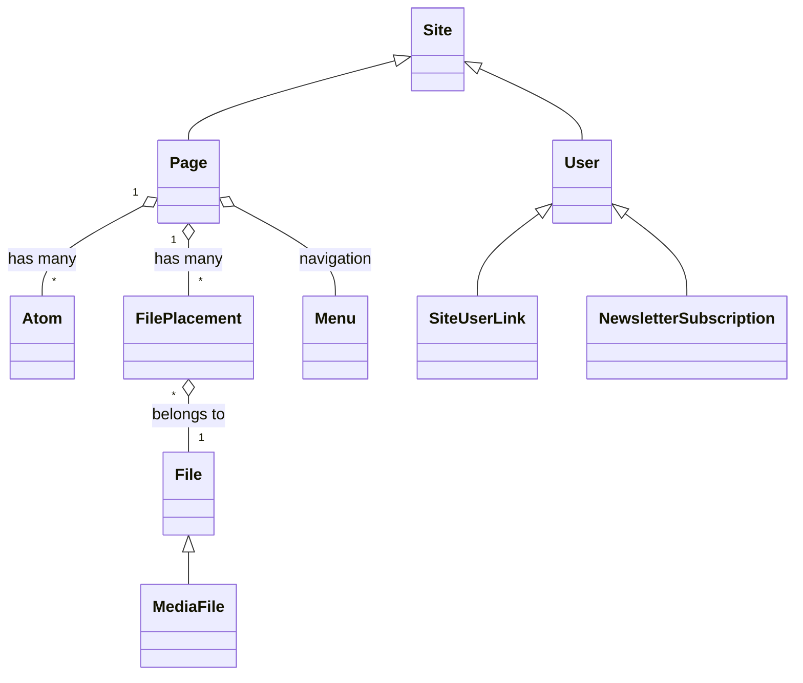

# Architecture

This chapter provides a high-level overview of the Folio Rails Engine architecture, including its main models, relationships, and key data flows. Use this as a reference for understanding how the engine is structured and how its core components interact.

---

## Engine Structure

Folio is a modular CMS engine for Ruby on Rails, designed for extensibility and maintainability. It provides:
- A flexible content model based on Atoms and Pages
- A modern admin interface (Console)
- File and media management
- User and site management
- Extensible ViewComponent-based UI
- Optional feature packs for additional functionality

---

## Main Models and Relationships

Below is a simplified diagram of the main models and their relationships in Folio:

**Legend:**
- `Site` — Represents a website or subsite
- `Page` — Content page, composed of Atoms and Files
- `Atom` — Content block (text, image, video, etc.)
- `File` — Uploaded file or media asset
- `User` — User account
- `Menu` — Navigation structure
- `FilePlacement` — Placement of a file on a page
- `NewsletterSubscription` — Newsletter signup
- `SiteUserLink` — User-to-site relationship

---

## Key Data Flows

### Content Rendering
- Pages are composed of Atoms (content blocks) and Files (media)
- Atoms are rendered using ViewComponents for flexibility and reusability
- Menus and navigation are managed via Menu and MenuItem models

### File Upload & Management
- Files are uploaded via the admin console or public forms
- FilePlacements associate files with pages or atoms
- Metadata is extracted and stored for each file

### User & Site Management
- Users can belong to one or more Sites via SiteUserLink
- User roles and permissions are managed in the admin console

---

## Packs Architecture

Folio uses a **packs** system to organize optional features into self-contained modules. This architecture is inspired by Shopify's modular monolith approach and uses **Packwerk** for enforcing boundaries between packs.

Packs allow you to:

- Keep feature code organized in a single directory (`packs/<name>/`)
- Enable or disable features per application via configuration
- Easily remove features by deleting the pack directory
- Co-locate models, migrations, tests, and factories
- Enforce dependency boundaries via Packwerk static analysis

Packs are loaded automatically based on the `Folio.enabled_packs` configuration. Each pack can include:

- **Models** - ActiveRecord models and concerns
- **Migrations** - Database migrations
- **Tests** - Test files
- **Factories** - FactoryBot definitions
- **Railtie** - Rails integration code
- **package.yml** - Packwerk configuration for dependencies

For more details, see the [Packs documentation](packs.md).

---

## Navigation

- [← Back to Overview](overview.md)
- [Next: Components →](components.md)
- [Atoms](atoms.md) | [Admin Console](admin.md) | [Files & Media](files.md) | [Concerns](concerns.md) | [Jobs](jobs.md) | [Packs](packs.md)

---

*For more details, see the individual chapters linked above. This architecture overview will be updated as the documentation evolves.* 
