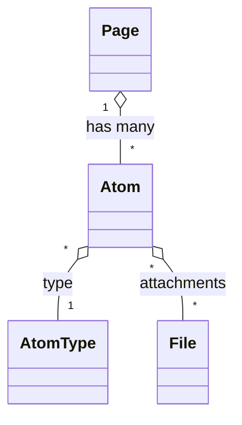

# Atoms (CMS Blocks)

This chapter explains the concept of Atoms in the Folio Rails Engine—referred to as **CMS blocks** for clients—how they enable flexible content modeling, and how to define and extend block types for your project.

---

## Introduction

**CMS blocks** (internally called Atoms) are the building blocks of content in Folio. Each block represents a discrete piece of content—such as text, image, video, or a custom block—that can be composed into Pages. This approach enables highly flexible, modular, and reusable content structures.

---

## How CMS Blocks (Atoms) Work

- CMS blocks are associated with Pages (or other models) and define the structure and data for each content block.
- Each block has a type (e.g., Text, Image, Video), which determines its fields and rendering logic.
- Blocks are rendered using ViewComponents, allowing for custom presentation and behavior.
- Blocks can be reordered, added, or removed via the admin console.

---

## Default CMS Blocks in a Project

Folio core ships with the **base Atom model only**; concrete CMS block types are generated per project using the generator shown below. Typical projects tend to include blocks such as:

- **TextAtom** — Rich text content (`content` field)
- **ImageAtom** — Image with optional caption or link (`file`, `caption`, `link_url` fields)
- **VideoAtom** — Embedded video (`url`, `caption` fields)
- **QuoteAtom** — Highlighted quote (`quote`, `author` fields)
- **GalleryAtom** — Image gallery (`files`, `caption` fields)

The exact list depends on which generators have been run in your codebase. Check your `app/models/folio/atom/` directory for the blocks currently available in your project.

---

## Creating and Customizing CMS Blocks (Recommended: Generator)

> **Best Practice:** Always use the provided Folio generator to create new CMS blocks (Atoms). This ensures all necessary files and structure are created correctly and consistently.

To generate a new CMS block (Atom), run:

```sh
rails generate folio:atom MyCustomAtom
```

This command will:
- Create a new Atom class in `app/models/folio/atom/my_custom_atom.rb`
- Generate a corresponding ViewComponent in `app/components/folio/atom/my_custom_atom_component.rb`
- Add Slim, SASS, and JS files as needed
- Register the new block type for use in the admin console

For more details and advanced options, see the [Extending & Customization](extending.md) chapter.

---

## Advanced: Manual Customization

Manual creation or editing of CMS block files is only recommended for advanced use cases. If you need to customize generated files, follow these principles:
- Keep block types focused and single-purpose
- Use BEM and SASS for styling block components
- Document the purpose and usage of each block type
- Use strong parameter validation for block fields
- Leverage ViewComponent for custom rendering and logic
- Maintain backward compatibility for existing content

---

## Atoms Relationship Diagram (Mermaid)



---

## Navigation

- [← Back to Overview](overview.md)
- [← Back to Architecture](architecture.md)
- [← Back to Components](components.md)
- [Next: Admin Console →](admin.md)
- [Files & Media](files.md)
- [Extending & Customization](extending.md)

---

*For more details, see the individual chapters linked above. This Atoms (CMS blocks) overview will be updated as the documentation evolves.* 