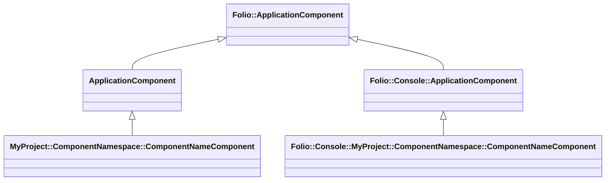

# Components

This chapter describes the component-based architecture of the Folio Rails Engine, focusing on UI development with ViewComponent, BEM methodology and Stimulus.

---

## Introduction

Folio uses a modern, modular approach to UI development based on [ViewComponent](https://viewcomponent.org/). Components are organized for clarity, reusability, and maintainability, following BEM naming conventions and leveraging Stimulus for JavaScript behavior.

Legacy Trailblazer Cells are still bundled for backwards compatibility but are scheduled for removal in the next major release.

---

## Creating Components (Recommended: Generator)

> **Best Practice:** Always use the provided Folio generator to create new components. This ensures all necessary files and structure are created correctly and consistently.

To generate a new component, run:

```sh
rails generate folio:component MyComponentNamespace::MyComponent
```

This command will:
- Create a new component class in `app/components/my_application_namespace/my_component_namespace/my_component.rb`
- Generate a corresponding Slim template
- Set up the correct directory structure and naming conventions

For more details and advanced options, see the [Extending & Customization](extending.md) chapter.

---

## Directory Structure Example

```
app/components/
  my_application_namespace/
    atom/                # Atomic content components
    ui/                  # Shared UI components
    ...
    my_component_namespace/
      my_component.rb    # Component class
      my_component.slim  # Slim template
      my_component.sass  # Component styles (BEM)
      my_component.js    # Optional JS (Stimulus/React)
```

---

## Best Practices

- **Naming:**
  - Use descriptive, purpose-indicating names
  - Suffix with `Component`
  - Namespace under `Folio::`
- **Organization:**
  - Group related components in subdirectories
  - Keep components focused and single-purpose
- **Styling:**
  - Use SASS with BEM methodology
  - Block (B) is generated from component class name: first letter (lowercase) of top-level namespace + rest of namespace path in kebab-case
    - Example: `MyApp::Blog::PostComponent` → Block is `"m-blog-post"`
    - Special case: `Folio::Console::` → `f-c`
  - Elements (E) and Modifiers (M) follow standard BEM: `__element` and `--modifier`
    - Example: `m-blog-post__button` (element), `m-blog-post__button--active` (modifier)
  - Scope styles to the component
- **JavaScript Integration:**
  - Use Stimulus for behavior
  - Place JS in the same directory as the component
- **Templates:**
  - Use Slim for templates
  - Keep templates minimal and focused
- **Documentation:**
  - Document public interface and usage
  - Include usage examples

---

## Advanced: Manual Customization

Manual creation or editing of component files is only recommended for advanced use cases. If you need to customize generated files, follow best practices for naming, organization, styling, and documentation.

---

## Component Relationships (Mermaid)



## Advanced Component Topics

### Togglable Fields Component
`Folio::TogglableFieldsComponent` lets you reveal/hide parts of a form based on a checkbox or select value.
```slim
= render Folio::TogglableFieldsComponent.new(form: f) do |c|
  = c.toggler f.input :show_advanced, as: :boolean
  = c.fieldset do
    = f.input :advanced_option
```
The generator `rails generate folio:component TogglableFields` shows the full pattern.

---

*Note: This is a simplified example. Actual component hierarchy may vary.*

## Navigation

- [← Back to Overview](overview.md)
- [← Back to Architecture](architecture.md)
- [Next: Atoms →](atoms.md)
- [Admin Console](admin.md) | [Files & Media](files.md)
- [Extending & Customization](extending.md) 

---

*For more details, see the individual chapters linked above. This components overview will be updated as the documentation evolves.* 
