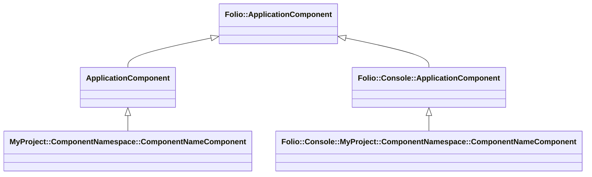

# Components

This chapter describes the component-based architecture of the Folio Rails Engine, focusing on UI development with ViewComponent, BEM methodology and Stimulus.

---

## Introduction

Folio uses a modern, modular approach to UI development based on [ViewComponent](https://viewcomponent.org/). Components are organized for clarity, reusability, and maintainability, following BEM naming conventions and leveraging Stimulus for JavaScript behavior.

Legacy Trailblazer Cells are still bundled for backwards compatibility but are scheduled for removal in the next major release.

---

## Creating Components (Recommended: Generator)

> **Best Practice:** Always use the provided Folio generator to create new components. This ensures all necessary files and structure are created correctly and consistently.

To generate a new component, run:

```sh
rails generate folio:component MyComponentNamespace::MyComponent
```

This command will:
- Create a new component class in `app/components/my_application_namespace/my_component_namespace/my_component.rb`
- Generate a corresponding Slim template
- Set up the correct directory structure and naming conventions

For more details and advanced options, see the [Extending & Customization](extending.md) chapter.

---

## Directory Structure Example

```
app/components/
  my_application_namespace/
    atom/                # Atomic content components
    ui/                  # Shared UI components
    ...
    my_component_namespace/
      my_component.rb    # Component class
      my_component.slim  # Slim template
      my_component.sass  # Component styles (BEM)
      my_component.js    # Optional JS (Stimulus/React)
```

---

## Best Practices

- **Naming:**
  - Use descriptive, purpose-indicating names
  - Suffix with `Component`
  - Namespace under `Folio::`
- **Organization:**
  - Group related components in subdirectories
  - Keep components focused and single-purpose
- **Styling:**
  - Use SASS with BEM methodology
  - Block (B) is generated from component class name: first letter (lowercase) of top-level namespace + rest of namespace path in kebab-case
    - Example: `MyApp::Blog::PostComponent` → Block is `"m-blog-post"`
    - Special case: `Folio::Console::` → `f-c`
  - Elements (E) and Modifiers (M) follow standard BEM: `__element` and `--modifier`
    - Example: `m-blog-post__button` (element), `m-blog-post__button--active` (modifier)
  - Scope styles to the component
- **JavaScript Integration:**
  - Use Stimulus for behavior
  - Place JS in the same directory as the component
- **Ruby:**
  - Most instance methods can be `private`; ViewComponent still exposes them to the template
- **Composition vs inheritance:**
  - Avoid subclassing one ViewComponent from another when each has its own template; prefer **composition** (render a child component) instead
- **Dependencies (no hidden global state):**
  - Pass data in explicitly (`initialize` arguments, slots) rather than reading `params`, the current URL, or other request-global state inside the component—improves reuse and makes behavior obvious in tests
- **Templates:**
  - Use Slim for templates
  - Keep templates minimal and focused
  - Avoid heavy inline Ruby in templates; move logic to instance methods on the component class
- **Partials, helpers, and markup:**
  - Prefer ViewComponents over partials and over helpers that return HTML
  - Prefer **slots** for nested markup; avoid passing HTML via `html_safe` string arguments (that bypasses Rails sanitization and is risky)
- **Testing:**
  - Always assert against **rendered output** (for example with `render_inline` and expectations on the HTML or text), not by calling component instance methods in isolation
  - Treat the component as a black box from the user’s perspective: what matters is what appears in the response
  - **One render per test:** issue a single `render_inline` (or equivalent) per example; split different props or states into separate tests instead of one long test with several renders
- **Migrations from partials/views:**
  - A large `initialize` often reflects real dependencies—that is useful signal for later refactors, not something to hide
- **Documentation:**
  - Document public interface and usage
  - Include usage examples

For broader guidance aligned with upstream ViewComponent, see [ViewComponent: Best practices](https://viewcomponent.org/best_practices.html).

---

## Advanced: Manual Customization

Manual creation or editing of component files is only recommended for advanced use cases. If you need to customize generated files, follow best practices for naming, organization, styling, and documentation.

---

## Component Relationships (Mermaid)


```mermaid
classDiagram
    class FolioApplicationComponent["Folio::ApplicationComponent"]
    class ApplicationComponent
    class FolioConsoleApplicationComponent["Folio::Console::ApplicationComponent"]
    class MyProjectComponent["MyProject::ComponentNamespace::ComponentNameComponent"]
    class FolioConsoleMyProjectComponent["Folio::Console::MyProject::ComponentNamespace::ComponentNameComponent"]

    FolioApplicationComponent <|-- ApplicationComponent
    FolioApplicationComponent <|-- FolioConsoleApplicationComponent
    ApplicationComponent <|-- MyProjectComponent
    FolioConsoleApplicationComponent <|-- FolioConsoleMyProjectComponent
```

## Advanced Component Topics

### Togglable Fields Component
`Folio::TogglableFieldsComponent` lets you reveal/hide parts of a form based on a checkbox or select value.
```slim
= render Folio::TogglableFieldsComponent.new(form: f) do |c|
  = c.toggler f.input :show_advanced, as: :boolean
  = c.fieldset do
    = f.input :advanced_option
```
The generator `rails generate folio:component TogglableFields` shows the full pattern.

---

*Note: This is a simplified example. Actual component hierarchy may vary.*

## Navigation

- [← Back to Overview](overview.md)
- [← Back to Architecture](architecture.md)
- [Next: Atoms →](atoms.md)
- [Admin Console](admin.md) | [Files & Media](files.md)
- [Extending & Customization](extending.md)

---

*For more details, see the individual chapters linked above. This components overview will be updated as the documentation evolves.*
