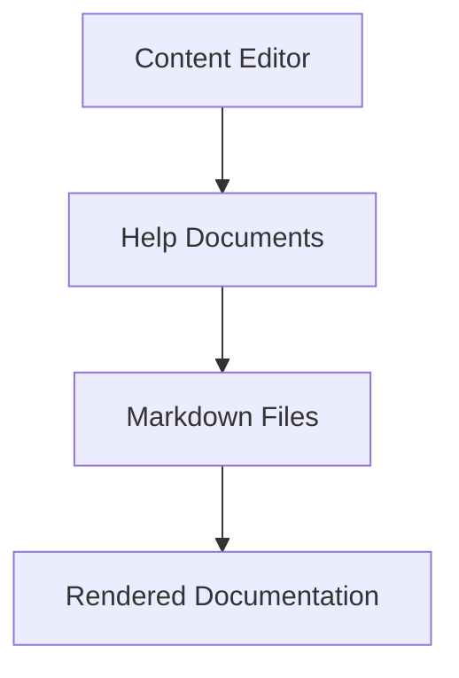

# Help Documents

This chapter describes the Folio Help Documents feature, which allows developers to create structured documentation for administrators and content editors directly within the console interface.

---

## Introduction

The Help Documents feature enables applications to display Markdown documentation files in the Folio console interface. This is particularly useful for:

- Creating user guides for content editors
- Providing project-specific documentation (changelogs, release notes)
- Sharing technical documentation with site administrators
- Displaying troubleshooting guides

Help Documents support full Markdown rendering, including code blocks, tables, and Mermaid diagrams for flowcharts and other visualizations.

---

## Configuration

### Basic Setup

1. Create a configuration file `doc/help/index.yml` in your application root:

```yaml
documents:
  - slug: changelog
    title: "Project Changelog"
    description: "Overview of changes and updates"
    order: 1
    category: "Documentation"
    
  - slug: user-guide
    title: "User Guide"
    description: "How to use the content management system"
    order: 2
    category: "Guides"
```

2. Create your Markdown files in the `doc/help/` directory (e.g., `doc/help/changelog.md`, `doc/help/user-guide.md`).

3. The Help Documents link will automatically appear in the console sidebar when configuration is detected.

### Configuration Options

| Field | Required | Description |
|-------|----------|-------------|
| `slug` | Yes | Unique identifier for the document (used in URLs) |
| `title` | Yes | Display title in the interface |
| `description` | No | Short description shown in document list |
| `order` | No | Sort order (defaults to array index) |
| `category` | No | Groups documents under category headers |

**Important:** Files are automatically looked up in `doc/help/{slug}.md`. If you need a different location, you can add a `path` field with a relative path from the application root.

---

## Access Permissions

- **Ghost role** does not have access to help documentation
- All other console roles automatically have access to Help Documents
- If you need different restrictions, you can modify the permission definitions in the `Ability` model

---

## Markdown Features

Help Documents support standard Markdown plus additional features:

### Code Highlighting

```ruby
def example_method
  puts "Syntax highlighting works!"
end
```

### Tables

| Feature | Supported |
|---------|-----------|
| Tables | ✅ Yes |
| Code blocks | ✅ Yes |
| Mermaid diagrams | ✅ Yes |

### Mermaid Diagrams

Help Documents automatically detect and render Mermaid diagrams:



---

## File Organization

### Recommended Structure

```
your-app/
├── doc/
│   └── help/
│       ├── index.yml          # Configuration file
│       ├── user-guide.md      # User documentation
│       └── troubleshooting.md # Support docs
├── CHANGELOG.md               # Project changelog (can also be used)
└── README.md                  # Project overview
```

### Best Practices

- **Use descriptive slugs**: Choose meaningful, URL-friendly identifiers
- **Organize by category**: Group related documents under categories
- **Keep files updated**: Documentation automatically updates based on Git history or file modification time
- **Include examples**: Add code snippets and screenshots where helpful

---

## Customization

### Styling

Help Documents inherit console styling but can be customized via CSS:

```scss
.folio-console-help-documents-show {
  .folio-console-help-content {
    font-size: 1.1rem;
    
    .mermaid {
      background-color: #f8f9fa;
    }
  }
}
```

### Custom Layouts

The Help Documents views can be overridden in your application:

```
app/views/folio/console/help_documents/
├── index.slim    # Document list
└── show.slim     # Document display
```

---

## Troubleshooting

### Common Issues

**Documents not appearing in sidebar**
- Ensure `doc/help/index.yml` exists and is valid YAML
- Check that at least one document is configured with a valid slug

**Markdown not rendering**
- Verify that the Markdown file exists in `doc/help/{slug}.md`
- Check file permissions are readable by the Rails application

**Mermaid diagrams not displaying**
- Ensure code blocks use `mermaid` language identifier
- Check browser console for JavaScript errors

**Permission errors**
- Ghost role does not have access to documentation (this is intended behavior)
- For other roles, check CanCan abilities if you have custom authorization

### Debug Information

You can inspect Help Documents configuration in the Rails console:

```ruby
# Check if configuration exists
Folio::HelpDocument.config_exists?

# List all documents
Folio::HelpDocument.all.map(&:title)

# Inspect specific document
doc = Folio::HelpDocument.find('changelog')
puts doc.content.length
puts doc.updated_at
```

---

## Security Considerations

- Markdown files are processed server-side
- Only configured files in specified paths can be accessed
- No user input is processed for file paths
- External JavaScript (Mermaid) is loaded securely via Folio's RemoteScripts system
- Ghost role does not automatically have access to documentation 